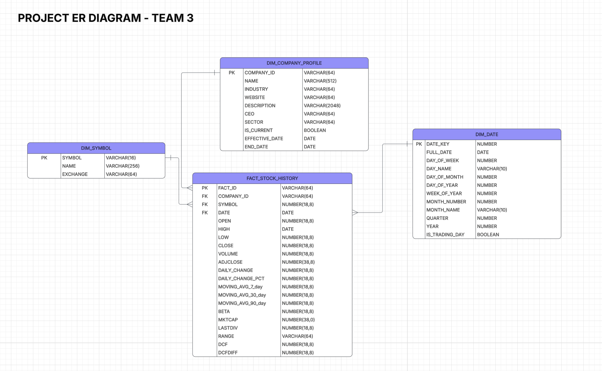

Overview
========

This is dimensional data warehouse built with **dbt**, **Airflow**, and **Snowflake** for analyzing stock market data.

ER Diagram
================

Tech Stack
===========================

| Component | Technology | Purpose |
|-----------|-----------|---------|
| **Data Warehouse** | Snowflake | Cloud data warehouse |
| **Transformation** | dbt (Data Build Tool) | SQL-based transformations |
| **Orchestration** | Apache Airflow | Workflow scheduling & monitoring |
| **Version Control** | Git/GitHub | Code repository |
| **Data Quality** | dbt tests | Automated testing |
| **Language** | SQL, Python | Data transformation & orchestration |

